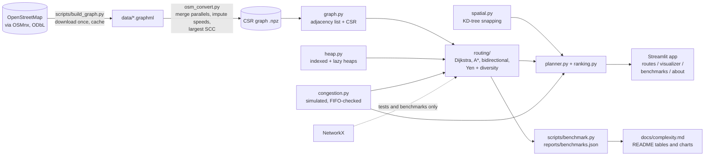
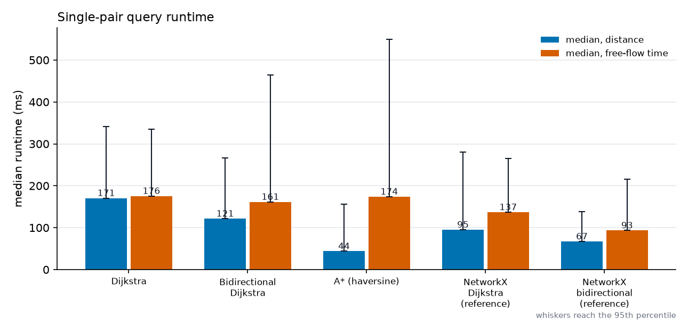
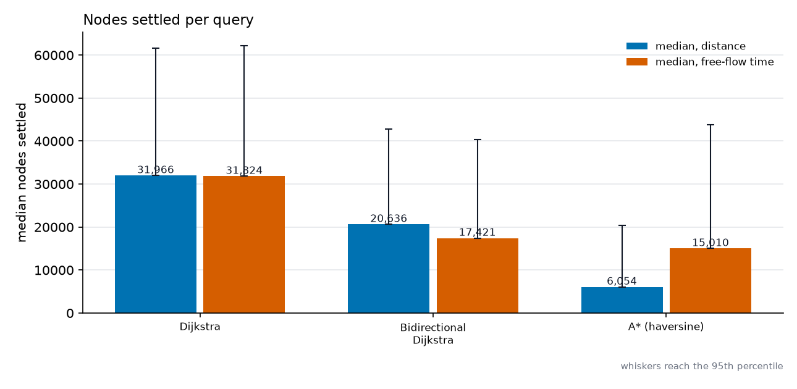
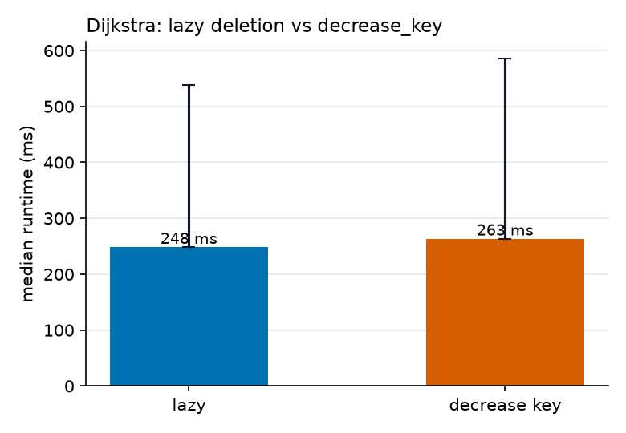
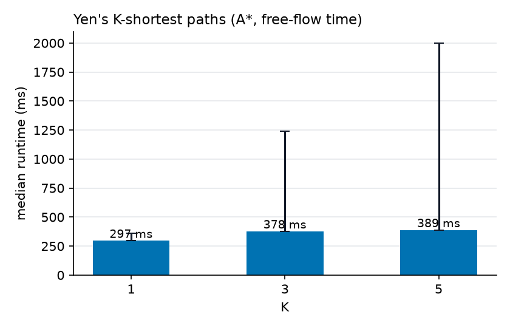
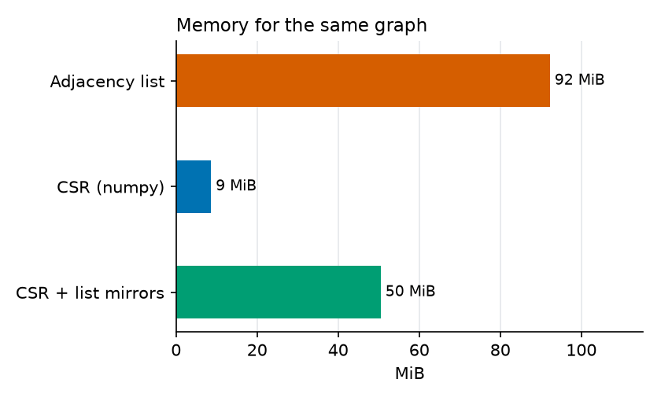

# Karachi Route Finder

A computer-science project that models Karachi's real road network as a **weighted directed graph** and returns several **ranked
routes** between a pickup and a destination. The graph structures, priority queue, Dijkstra, A*, bidirectional Dijkstra, Yen's
K-shortest paths, the time-dependent search and the nearest-node index are all **written from scratch**; NetworkX is used only as
a reference oracle in tests and benchmarks. A Streamlit app draws the routes on a map, and the repository ships correctness
tests, measured benchmarks and a written complexity analysis.

> **Traffic is simulated.** There is no free live traffic feed for Karachi, so congestion comes from an assumed time-of-day
> model. Every travel time shown is an estimate, not a real prediction. See [How congestion is simulated](#how-congestion-is-simulated).


## Problem

Given two places in Karachi and a departure time, return **K different, sensible routes**, rank them by a blend of estimated
time, distance and congestion, and be able to explain (and measure) how the routing works. Real road networks make this harder
than it sounds: parallel edges, one-way streets, missing speed limits, and alternatives that differ by a single block.

## Architecture



## The graph after cleaning

<!-- BEGIN:graph_stats -->
_Run `python -m scripts.build_graph` and then `python -m scripts.render_reports` to fill this block._
<!-- END:graph_stats -->

Cleaning steps: drivable network from OSM (`network_type="drive"`), largest strongly connected component only, one-way streets
kept as directed edges, parallel edges merged into the cheapest for each weight type, self-loops removed, and speeds filled from
a per-class table wherever OSM has no usable `maxspeed` (those edges are flagged). Note that OSMnx's `drive` filter excludes
`highway=service`, so the service-road speed in the config table is defined but unused for this network.

## Algorithms and why each exists

| Piece | File | Why it is here |
|---|---|---|
| Adjacency list and CSR graphs | `src/graph.py` | the simple structure and the compact one, with a measured memory comparison |
| Indexed heap (`decrease_key`) and lazy heap | `src/heap.py` | the two standard priority-queue strategies, benchmarked against each other |
| Dijkstra | `src/routing/dijkstra.py` | baseline exact search, early exit, counters for settled nodes and relaxed edges |
| A* (haversine heuristic) | `src/routing/astar.py` | goal-directed search; admissible and consistent (proof in `docs/algorithms.md`) |
| Bidirectional Dijkstra | `src/routing/bidirectional.py` | two smaller search discs; correct stopping rule |
| Yen's K shortest paths + diversity filter | `src/routing/yen.py` | several loopless alternatives, filtered for real diversity |
| Time-dependent search | `src/congestion.py` | edge cost depends on the clock time you reach it; FIFO-checked |
| KD-tree | `src/spatial.py` | snap a clicked point to the nearest road node |
| Ranking | `src/ranking.py` | blend of time, distance and congestion; "Fastest / Shortest / Least congested" labels |

The proofs (A* admissibility and consistency, why stopping bidirectional search at the first meeting node is wrong, FIFO of the
congestion model, Yen's correctness and the diversity trade-offs) are in [docs/algorithms.md](docs/algorithms.md). Time and space
complexity, each linked to a measured result, are in [docs/complexity.md](docs/complexity.md).

### A note on diverse alternatives

Plain Yen's plus a similarity filter is not enough on a dense road grid: the fastest route has a combinatorial number of
near-identical variants (one block detoured here, another there) and they all outrank a genuinely different corridor. So when
the diversity filter is on, the candidate generator is restricted: a spur path may not rejoin its parent route for a stretch
whose length is derived from the overlap threshold, spur nodes are sampled instead of tried one by one, and candidates costing
more than 1.5x the fastest are discarded. With these switched off the function is exact Yen's (that is what the correctness tests
compare against NetworkX). The restricted mode is a heuristic candidate generator and can miss some alternatives.

## Benchmarks

<!-- BEGIN:bench_meta -->
_Run `python -m scripts.benchmark` and then `python -m scripts.render_reports` to fill this block._
<!-- END:bench_meta -->

### Single-pair shortest paths

<!-- BEGIN:bench_shortest -->
_Not measured yet._
<!-- END:bench_shortest -->

<!-- BEGIN:bench_ratios -->
_Not measured yet._
<!-- END:bench_ratios -->

<!-- BEGIN:bench_correctness -->
_Not measured yet._
<!-- END:bench_correctness -->




### Priority queue strategy inside Dijkstra

<!-- BEGIN:bench_heap -->
_Not measured yet._
<!-- END:bench_heap -->



### Yen's K-shortest paths

<!-- BEGIN:bench_yen -->
_Not measured yet._
<!-- END:bench_yen -->

Application-level diverse routes (simulated time-dependent congestion, overlap threshold 0.7):

<!-- BEGIN:bench_diverse -->
_Not measured yet._
<!-- END:bench_diverse -->



### Scaling and memory

<!-- BEGIN:bench_scaling -->
_Not measured yet._
<!-- END:bench_scaling -->


<!-- BEGIN:bench_memory -->
_Not measured yet._
<!-- END:bench_memory -->



## The algorithm visualizer

The visualizer page solves one trip with Dijkstra, bidirectional Dijkstra and A* and paints the nodes each one had to settle, with
exact counts, so the difference in explored area is visible.


## How congestion is simulated

* A **daily curve** gives a multiplier on free-flow travel time for every 15-minute slot, with a separate weekday and weekend
  curve. Weekdays peak around 08:00-10:00 and 17:00-20:00. The multiplier is defined at slot starts and linearly interpolated
  in between.
* A **per-road-class sensitivity** scales how much of the curve each class feels (primary roads feel all of it, service roads
  a quarter).
* **Named corridors** (Shahrah-e-Faisal, M.A. Jinnah Road, University Road, I.I. Chundrigar Road) get an extra multiplier,
  matched on the OSM road name including common spellings and the Urdu names OSM uses. These are assumptions, and only the
  edges that carry a name in OSM can be matched.
* The search is **time-dependent**: the cost of an edge is evaluated at the clock time you reach it, starting from the departure
  time you choose. The **FIFO** property (leaving later never arrives earlier) is verified when the model is built and tested.
* A route's **congestion level** is the length-weighted average multiplier, labelled Low, Moderate or Heavy by thresholds in
  `src/config.py`.

All numbers are in [`src/config.py`](src/config.py).

## Setup

Python 3.11 or newer. On Windows PowerShell:

```powershell
py -3.12 -m venv .venv
.venv\Scripts\Activate.ps1
pip install -r requirements.txt -r requirements-osm.txt
```

`requirements-osm.txt` (OSMnx) is only needed to download and convert the map. CI and the tests do not need it.

### Build the graph (once)

```powershell
python -m scripts.build_graph
```

The first run downloads the drivable network from OpenStreetMap through the Overpass API (a few minutes) and caches it under
`data/`; later runs load the cache and never download again. `--rebuild` repeats only the conversion from the cached download,
`--redownload` fetches the data again.

**Choosing the area.** `src/config.py` holds the areas. The default `"central"` is a bounding box around central Karachi
(Saddar, Clifton, PECHS, Gulshan, plus the airport corridor so that the built-in places resolve). To use the whole city, either
set `AREA = "full"` in `src/config.py` or set an environment variable before every command:

```powershell
$env:KRF_AREA = "full"
python -m scripts.build_graph
```

To use your own bounding box, edit the `north/south/east/west` values of the `"central"` entry. Each area has its own cache file
(`data/karachi_drive_<area>.graphml` and `.npz`). The full city is several times larger, so the pure-Python searches take
correspondingly longer.

### Run the app

```powershell
streamlit run streamlit_app.py
```

If the graph cache is missing the app tells you to run `python -m scripts.build_graph`.

### Run the tests

```powershell
pytest
```

The suite runs on synthetic graphs and needs no network. Tests marked `real_graph` (for example A* equals Dijkstra on 200 random
pairs of the real graph, and every built-in place snaps to a road within 300 m) run automatically when the graph cache exists and
skip otherwise. `pytest -m "not real_graph"` skips them.

What is tested: the heap against `heapq` (Hypothesis); Dijkstra, bidirectional Dijkstra and A* against NetworkX on hundreds of
random weighted directed graphs and on hand-made graphs (unreachable targets, source equals target, zero-weight edges, parallel
edges); the inadmissible-heuristic counterexample; the bidirectional first-meeting counterexample; Yen's first K costs against
`networkx.shortest_simple_paths` and never returning a loop; FIFO and departure-time sensitivity of the time-dependent search
(against an independent label-correcting oracle and brute-force path enumeration); the KD-tree against brute force; a check that
`src/routing` does not import NetworkX; an app smoke test with `streamlit.testing.v1.AppTest` on a synthetic graph.

### Run the benchmarks

```powershell
python -m scripts.benchmark
python -m scripts.render_reports
```

`benchmark` writes `reports/benchmarks.json` (500 random pairs with a fixed seed; median and 95th percentile of runtime, nodes
settled and edges relaxed; scaling over sub-areas; memory). It takes about an hour in pure Python. `--sections` runs a subset and
`--pairs` changes the sample size. `render_reports` regenerates the charts in `reports/figures/` and refreshes every table in this
README and in `docs/complexity.md` from the JSON.

## Project structure

```
src/
  config.py            areas, speeds, congestion profile, corridors, thresholds, weights
  graph.py             adjacency-list and CSR graphs, save/load, sub-graphs
  scc.py               iterative Tarjan strongly connected components
  heap.py              indexed (decrease_key) and lazy binary min-heaps
  routing/             dijkstra, astar, bidirectional, yen, weights, result
  congestion.py        simulated time-of-day model, corridors, FIFO check, route metrics
  spatial.py           KD-tree and snapping
  ranking.py, planner.py
  places.py, geocode.py
  osm_download.py, osm_convert.py    the only modules that touch OSMnx data
  ui/                  Streamlit pages
scripts/               build_graph, benchmark, render_reports
tests/                 pytest + Hypothesis suite
docs/                  algorithms.md, complexity.md, screenshots/
reports/               benchmarks.json, graph_stats.json, figures/
streamlit_app.py
```

## Limitations

* **Congestion is simulated.** The profile and corridor factors are assumptions; nothing here reflects real traffic, incidents,
  weather or events.
* **Speeds are mostly imputed.** Most Karachi roads have no `maxspeed` in OSM, so a per-class default is used (share reported
  above). These are free-flow speeds and a guess.
* **OSM gaps.** Some areas have missing roads, names or one-way tags; private and restricted roads (parts of the airport, for
  example) are absent. Only named edges can match a corridor, and most edges are unnamed.
* **No turn restrictions, turn penalties or traffic signals.** Times are optimistic at busy junctions.
* **Estimates only.** Not for real trip planning.
* **The diverse-route search is a heuristic** (rejoin window, spur stride, cost bound); it can miss alternatives.
* **Snapping** goes to the nearest node, which can be a short distance from the exact point.
* **Parallel edges are merged**, so the length and time of a merged edge can come from two different physical edges.
* **Pure Python.** Absolute runtimes are much larger than a compiled router; the benchmarks compare shapes and ratios.
* **Built-in place coordinates are approximate** and were checked only by snapping them to a nearby road.

## Future work

* Contraction hierarchies (or ALT landmarks) for fast point-to-point queries and a much cheaper Yen's.
* Turn penalties and junction delays, plus turn restrictions from OSM relations.
* Real traffic data (for example a GTFS-realtime or commercial speed feed) in place of the simulated profile, and calibration of
  the profile against it.
* A compiled core for the hot loops.

## Data licence and attribution

Road data © OpenStreetMap contributors, available under the [Open Database Licence (ODbL)](https://www.openstreetmap.org/copyright).
Map tiles © OpenStreetMap contributors. The optional place-name search calls the public Nominatim service and follows its usage
policy: opt-in only, at most one request per second, an identifying user agent (set your own contact details in
`NOMINATIM_USER_AGENT` in `src/config.py` before using it) and local caching of results.

## Screenshots to capture

Save these in `docs/screenshots/` (the README already links the first two):

1. `find-routes.png`: **Find routes** with the results map showing three coloured routes and the legend.
2. `algorithm-visualizer.png`: **Algorithm visualizer** after running the three algorithms on a long trip (for example
   Port Grand to NED University) so the explored areas differ visibly.
3. **Benchmarks** page, showing the charts.
4. **About & limitations** page.
