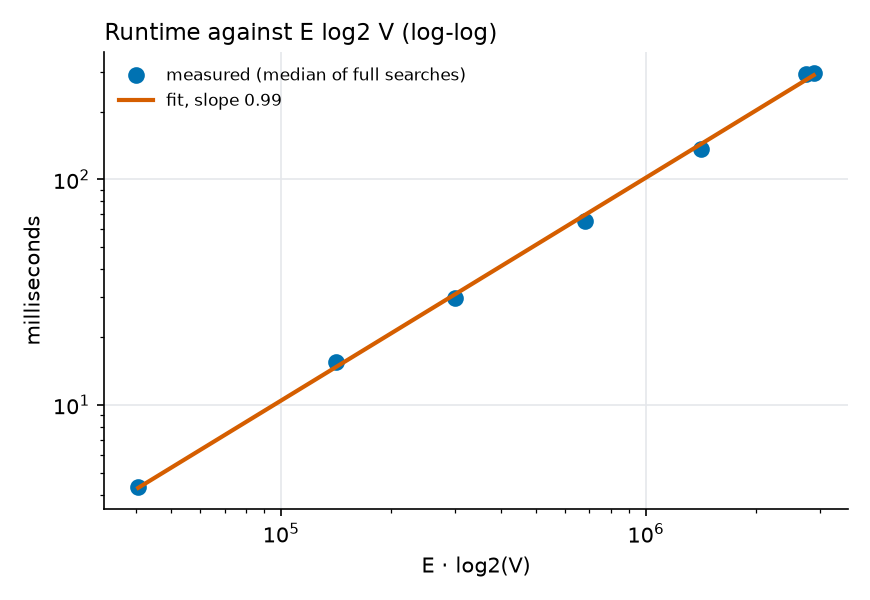

# Complexity analysis and measured results

**How to read this page.** Each section states the theoretical complexity and then links it to a measurement. Every number on
this page sits inside a generated block (between `BEGIN`/`END` markers) that `python -m scripts.render_reports` fills from
`reports/benchmarks.json` or from the graph build report. Nothing measured is typed by hand. Prose outside the blocks only
describes what the tables show.

Notation: `V` nodes, `E` directed edges, `K` routes. All algorithms are pure Python, so the constants are large compared with
compiled libraries; the *shape* of the results is what matters.

<!-- BEGIN:bench_meta -->
_Run `python -m scripts.benchmark` and then `python -m scripts.render_reports` to fill this block._
<!-- END:bench_meta -->

## The graph that was measured

<!-- BEGIN:graph_stats -->
_Run `python -m scripts.build_graph` and then `python -m scripts.render_reports` to fill this block._
<!-- END:graph_stats -->

## Summary of the theory

| Algorithm | Time | Space | Notes |
|---|---|---|---|
| Binary heap push / pop / `decrease_key` | O(log n) each | O(n) (lazy: O(pushes)) | `decrease_key` needs a position map |
| Dijkstra, binary heap | O((V + E) log V) | O(V) | with lazy deletion the heap holds up to O(E) entries, so the bound is O(E log E) = O(E log V) |
| A* | worst case the same as Dijkstra; with a good heuristic it settles far fewer nodes | O(V) | consistent heuristic: never settles a node Dijkstra would not |
| Bidirectional Dijkstra | worst case O((V + E) log V) | O(V) | two searches each covering roughly half the radius |
| Yen's K shortest paths | O(K · V · (E + V log V)) with a Fibonacci heap; O(K · V · (E + V) log V) with a binary heap | O(K · V) | K rounds, up to V spur searches per round |
| Time-dependent Dijkstra | same as Dijkstra, one interpolation per relaxation | O(V) | valid because the edge functions are FIFO |
| KD-tree build / query | O(n log² n) with per-level sorting / O(log n) average | O(n) | |
| Adjacency list / CSR | O(V + E) space | O(V + E) | different constants, measured below |

## Priority queue: `decrease_key` against lazy deletion

Both variants give O((V + E) log V) Dijkstra. Lazy deletion pushes a duplicate instead of updating an entry, so the heap is larger
and some pops are stale, but no position map has to be maintained. With `decrease_key` the heap stays at most V entries, at the
price of writing the position map on every swap.

<!-- BEGIN:bench_heap -->
_Not measured yet._
<!-- END:bench_heap -->

## Single-pair shortest paths: Dijkstra, bidirectional Dijkstra, A*

Dijkstra settles every node closer than the target: on a road network that is a disc of radius `d(s, t)`, so the work grows with
the *area*, roughly quadratically in the trip length. Bidirectional Dijkstra runs two discs of radius about `d/2`, so in the ideal
case it explores about half of the area. A* with a consistent heuristic explores an ellipse elongated towards the target; the
better the heuristic matches the true remaining cost, the thinner the ellipse. The haversine heuristic is a *straight-line*
bound, so it is tight for distance and looser for travel time (the maximum speed in the graph is well above the typical speed).

<!-- BEGIN:bench_shortest -->
_Not measured yet._
<!-- END:bench_shortest -->

Relative to plain Dijkstra, and against the NetworkX reference (a C-accelerated `heapq` under the hood):

<!-- BEGIN:bench_ratios -->
_Not measured yet._
<!-- END:bench_ratios -->

<!-- BEGIN:bench_correctness -->
_Not measured yet._
<!-- END:bench_correctness -->

## Yen's K-shortest paths

Yen's algorithm runs up to one spur search for every node of the previous path in each of the `K - 1` rounds. Each spur search is a
shortest-path search, so the bound is `K · V · (cost of one search)`. Two things make the practical cost far smaller than the
bound: the path has far fewer than `V` nodes, and Lawler's improvement skips spur nodes that would only regenerate known
candidates. The choice of search inside Yen's matters a lot: plain Dijkstra restarts from scratch each time, A* with the
haversine heuristic prunes a little, and A* with the exact reverse-distance heuristic (one backward search per query) prunes
almost everything when the weight is static.

Plain Yen's with static free-flow time:

<!-- BEGIN:bench_yen -->
_Not measured yet._
<!-- END:bench_yen -->

The application's diverse-route search (time-dependent simulated congestion, diversity filter with rejoin window, spur stride and
cost bound, `K` routes at overlap threshold 0.7):

<!-- BEGIN:bench_diverse -->
_Not measured yet._
<!-- END:bench_diverse -->

## Scaling with graph size

If the measured cost is `Θ(E log V)`, then plotting runtime against `E log₂ V` on log-log axes gives a straight line with slope
about 1. The measurement uses full single-source Dijkstra (no early exit, so every node is settled and the work is exactly the
theoretical quantity) on nested square sub-areas of the city, each reduced to its largest strongly connected component.

<!-- BEGIN:bench_scaling -->
_Not measured yet._
<!-- END:bench_scaling -->

## Space: adjacency list against CSR

An adjacency list stores one Python object per edge (object header, boxed floats, a tuple in the per-node list). CSR stores
`V + 1` offsets, `E` targets and one flat numpy array per attribute, so its size is the sum of the array sizes. The pure-Python
search reads Python-list mirrors of the CSR arrays because element access on a numpy array is slow, and those mirrors are counted
in the third row.

<!-- BEGIN:bench_memory -->
_Not measured yet._
<!-- END:bench_memory -->

## Time-dependent search and the FIFO check

A time-dependent search evaluates one interpolation per relaxed edge, so its asymptotic cost is that of Dijkstra. FIFO is
verified when the congestion model is built (see `docs/algorithms.md`, section 8):

<!-- BEGIN:fifo -->
_Run `python -m scripts.render_reports` with the graph built to fill this block._
<!-- END:fifo -->
